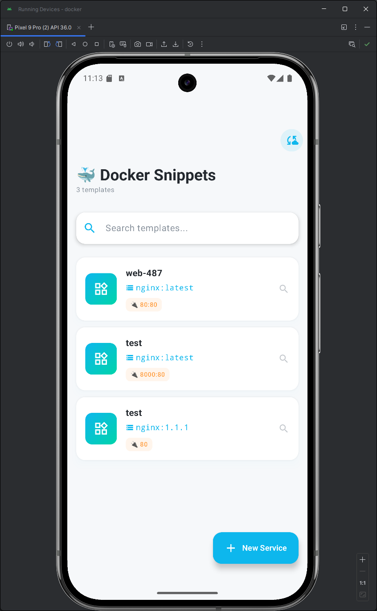
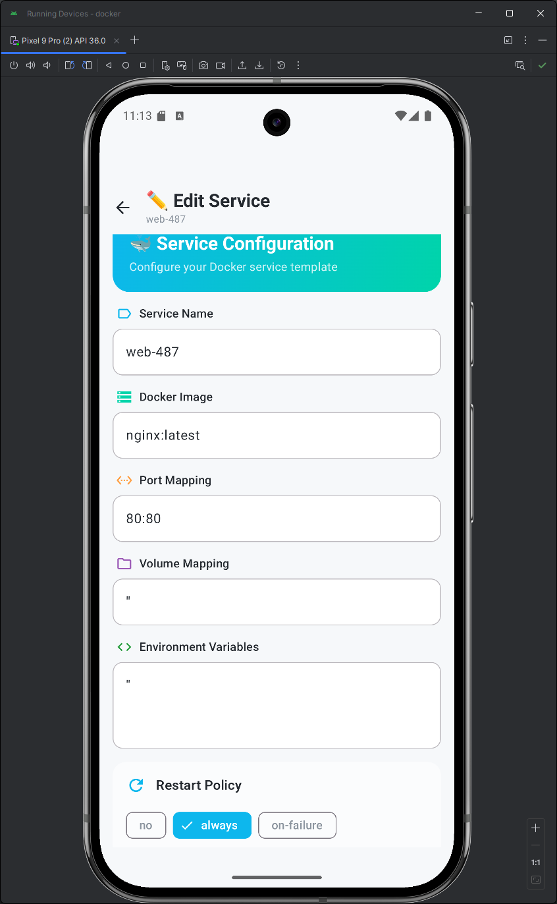
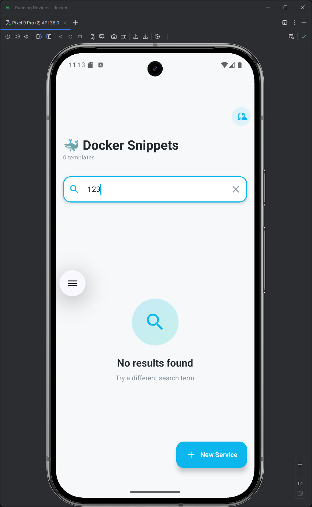
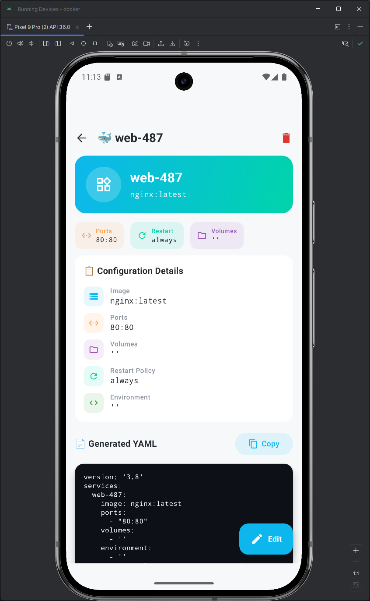
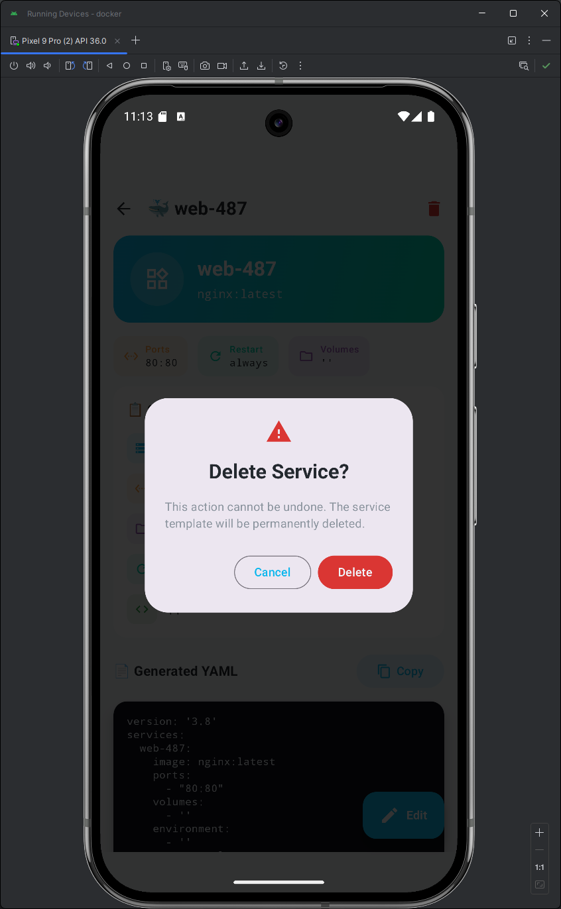

# Docker Compose Snippet Builder

> NTTU Android App 開發期末專案  
> 一款為 Server Admin 設計的 Docker Compose 配置管理工具

[](https://kotlinlang.org)
[](https://developer.android.com/jetpack/compose)
[](https://developer.android.com/training/data-storage/room)
[](https://supabase.com)

---

## 📖 專案簡介

**Docker Compose Snippet Builder** 解決了手動撰寫 Docker Compose YAML 配置檔繁瑣且容易出錯的問題。使用者可以透過直覺的圖形化介面建立可重複使用的 Service Template（如 Nginx、PostgreSQL、Redis），並一鍵生成符合語法規範的 `docker-compose.yml` 檔案。

### 核心特色

- ✅ **視覺化管理** - 圖形化介面管理 Docker Service Template
- ✅ **一鍵生成 YAML** - 自動組合成合法的 `docker-compose.yml`
- ✅ **雲端同步** - 透過 Supabase 實現多裝置資料同步
- ✅ **離線可用** - 本地優先策略，無網路也能正常使用
- ✅ **資料庫遷移** - 支援 Room Migration，升級不遺失資料

---

## 🏗️ 技術架構


### 技術棧

| 技術 | 用途 |
|------|------|
| **Kotlin** | 主要開發語言 |
| **Jetpack Compose** | 宣告式 UI 框架（Material 3） |
| **MVVM + Repository** | 架構模式，實現職責分離 |
| **Room Database** | 本地資料持久化（SQLite） |
| **Supabase** | 雲端資料庫與 API |
| **Coroutines & Flow** | 非同步處理與響應式資料流 |

---

## 🚀 功能列表

### 已完成功能

- [x] **CRUD 管理** - 新增、修改、刪除、查詢 Service Template
- [x] **動態 YAML 生成** - 根據 Template 自動組合 `docker-compose.yml`
- [x] **關鍵字搜尋** - 透過名稱或 Image 快速篩選
- [x] **資料庫遷移** - Room Migration (V1→V2→V3)
- [x] **雲端備份** - 上傳本地資料至 Supabase
- [x] **雲端還原** - 從 Supabase 下載資料至本地
- [x] **剪貼簿支援** - 一鍵複製生成的 YAML

### feuture-work

- [ ] Key-Value 環境變數表單 UI
- [ ] 多 Service 組合生成
- [ ] 差異化雲端同步
- [ ] Template 分類管理

---

## 📱 畫面截圖
#### 主畫面
  

#### 新增畫面
  

#### 搜尋畫面
  

#### 內部畫面


#### 刪除畫面


---

## 🗄️ 資料庫設計

### service_templates 表格

| 欄位 | 型別 | 說明 |
|------|------|------|
| `id` | INTEGER | Primary Key（自動遞增） |
| `name` | TEXT | Service 名稱 |
| `image` | TEXT | Docker Image |
| `ports` | TEXT | 埠號映射（如 `80:80,443:443`） |
| `volumes` | TEXT | Volume 掛載 |
| `env_vars` | TEXT | 環境變數（JSON 格式） |
| `restart_policy` | TEXT | 重啟策略（no/always/on-failure） |
| `created_at` | INTEGER | 建立時間戳 |

### Migration 歷程

- **V1 → V2**: 新增 `restart_policy` 欄位（預設值 `"no"`）
- **V2 → V3**: 當前版本

---

### 各層職責

- **View Layer**: Composable UI，訂閱 `StateFlow` 並顯示狀態
- **ViewModel Layer**: 持有 UI 狀態，處理使用者事件
- **Repository Layer**: 單一資料來源（SSOT），管理 Room 與 Supabase

---

## ☁️ 雲端整合
使用supabase作為雲端資料庫架構做為yaml檔案資料存放

### 同步策略

| 操作 | 本地 (Room) | 雲端 (Supabase) |
|------|------------|----------------|
| 新增 | 立即寫入 | 網路可用時上傳 |
| 刪除 | 立即刪除 | 網路可用時同步 |
| 備份 | 讀取所有資料 | 批次上傳（upsert） |
| 還原 | 清空後寫入 | 下載雲端資料 |

---

## 📦 安裝與執行

### 環境需求

- Android Studio Hedgehog (2023.1.1) 或更新版本
- Kotlin 1.9+
- Android SDK 24+（最低支援 Android 7.0）

### 執行步驟

1. Clone 專案
```bash
git clone https://github.com/yourusername/Docker-Compose-Snippet-Builder.git
cd Docker-Compose-Snippet-Builder
```

2. 設定 Supabase（選用）
   - 在 `local.properties` 加入：
   ```properties
   SUPABASE_URL=your_supabase_url
   SUPABASE_KEY=your_supabase_anon_key
   ```

3. 執行專案
```bash
./gradlew assembleDebug
```

---

## 📚 文檔

詳細文檔請參考 `docs/` 資料夾：

- [專案簡介與架構](./docs/1-專案簡介與架構.md)
- [資料庫設計與 ER 圖](./docs/2-資料庫設計與ER圖.md)
- [MVVM 架構與資料流](./docs/3-MVVM架構與資料流.md)
- [核心功能列表](./docs/4-核心功能列表.md)
- [完整專案文檔](./docs/5-完整專案文檔.md)

---

## 👨‍💻 作者

- 謝尚哲
- 鍾承翰

---

## 🙏 documents

- [Jetpack Compose](https://developer.android.com/jetpack/compose) - Google 官方 UI 框架
- [Room Database](https://developer.android.com/training/data-storage/room) - Android 本地資料庫
- [Supabase](https://supabase.com) - 開源 Firebase 替代方案
- [Material Design 3](https://m3.material.io) - Google 設計系統
