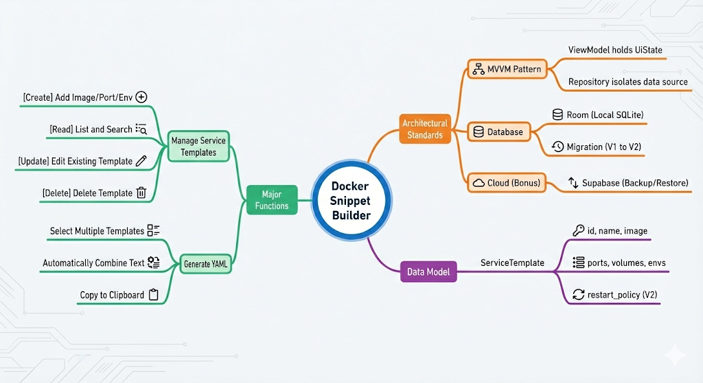
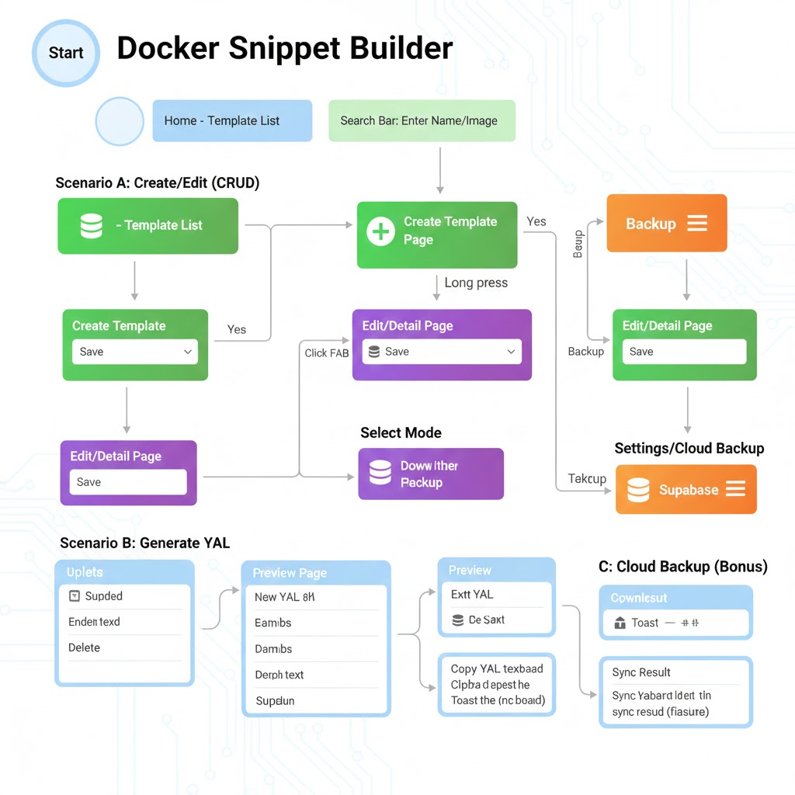

# 專案簡介與架構 (Overview)

## 專案摘要

**Docker Compose Snippet Builder** 是一款專為 Server Admin 與 DevOps 工程師設計的 Android 生產力工具。本專案旨在解決手動撰寫 Docker Compose YAML 配置檔時繁瑣且容易出錯的痛點。

使用者可以透過直覺的圖形化介面建立、管理多個 Docker Service Template（如 Nginx、PostgreSQL、Redis 等），並一鍵組合生成完整且符合語法規範的 `docker-compose.yml` 檔案。此外，本應用整合了雲端備份功能，讓使用者能夠在多裝置間同步配置，大幅提升工作效率。

---

## 技術架構

### 技術選型說明

| 技術棧 | 選用原因 |
|--------|----------|
| **Kotlin** | Android 官方推薦語言，具備 Null Safety、Coroutines 等現代化特性，提升開發效率與程式碼安全性 |
| **Jetpack Compose (Material 3)** | 宣告式 UI 框架，相較於傳統 XML 佈局更簡潔、可維護性更高，並支援最新的 Material Design 3 設計規範 |
| **MVVM + Repository Pattern** | 實現關注點分離（Separation of Concerns），View 層不直接操作資料來源，透過 ViewModel 與 Repository 確保單一資料來源（SSOT）原則 |
| **Android Room (SQLite)** | 官方推薦的本地資料庫解決方案，提供編譯時期的 SQL 驗證、Flow 支援，並簡化資料庫遷移（Migration）流程 |
| **Supabase (PostgreSQL)** | 開源的 Firebase 替代方案，提供 RESTful API 與即時資料庫功能，用於實現雲端備份與多裝置同步 |
| **Kotlin Coroutines & Flow** | 非同步處理的標準解決方案，避免 Callback Hell，並透過 Flow 實現響應式資料流，確保 UI 即時更新 |

---

## 使用者架構圖

本應用採用 **本地優先（Local-First）** 策略：
- 所有 CRUD 操作優先寫入本地 Room 資料庫，確保離線可用性
- 當網路可用時，自動或手動同步至 Supabase 雲端資料庫
- 使用者可隨時從雲端還原配置，實現跨裝置資料一致性
