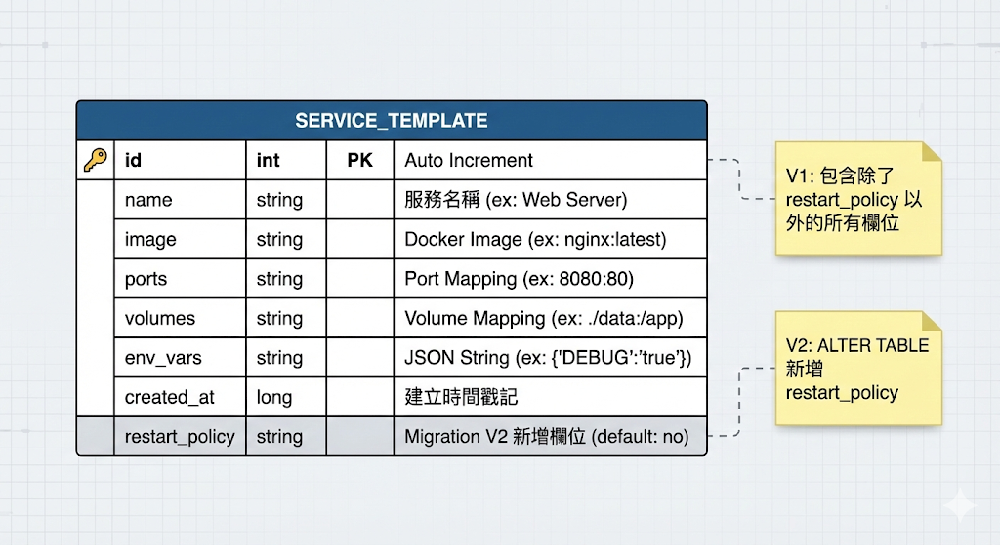

# 資料庫設計與 ER Diagram (Database)

## 資料表結構

### service_templates 表格定義

| 欄位名稱 | 資料型別 | 約束條件 | 說明 |
|---------|---------|---------|------|
| `id` | INTEGER | PRIMARY KEY, AUTO_INCREMENT | 唯一識別碼，自動遞增 |
| `name` | TEXT | NOT NULL | Service 名稱（如 nginx, postgres） |
| `image` | TEXT | DEFAULT '' | Docker Image 名稱（如 nginx:latest） |
| `ports` | TEXT | DEFAULT '' | 埠號映射，格式：`8080:80,443:443` |
| `volumes` | TEXT | DEFAULT '' | Volume 掛載，格式：`/host:/container` |
| `env_vars` | TEXT | DEFAULT '' | 環境變數，JSON 格式：`{"KEY":"VALUE"}` |
| `restart_policy` | TEXT | DEFAULT 'no' | 重啟策略（no, always, on-failure, unless-stopped） |
| `created_at` | INTEGER | NOT NULL | 建立時間戳（Unix Timestamp） |

---

## Entity 定義（Kotlin）

```kotlin
@Entity(tableName = "service_templates")
@Serializable
data class ServiceTemplate(
    @PrimaryKey(autoGenerate = true)
    val id: Int = 0,
    val name: String,
    val image: String = "",
    val ports: String = "",
    val volumes: String = "",
    @ColumnInfo(name = "env_vars")
    @SerialName("env_vars")
    val envVars: String = "",
    @ColumnInfo(name = "restart_policy")
    @SerialName("restart_policy")
    val restartPolicy: String = "no",
    @ColumnInfo(name = "created_at")
    @SerialName("created_at")
    val createdAt: Long = System.currentTimeMillis()
)
```

---

## Database Migration 說明

### 版本升級歷程

本專案實作了 **Room Database Migration**，確保應用程式升級時不會遺失使用者資料。

#### V1 → V2 Migration
- **新增欄位：** `restart_policy`
- **預設值：** `"no"`（符合 Docker Compose 預設行為）
- **目的：** 支援 Docker 容器重啟策略配置
- **相容性：** 舊版本資料自動補上預設值，無需手動處理

#### V2 → V3 Migration
- 目前版本為 V3，後續可擴充其他欄位（如 networks, depends_on）

### Migration 實作範例

```kotlin
val MIGRATION_1_2 = object : Migration(1, 2) {
    override fun migrate(database: SupportSQLiteDatabase) {
        database.execSQL(
            "ALTER TABLE service_templates ADD COLUMN restart_policy TEXT NOT NULL DEFAULT 'no'"
        )
    }
}
```

---

## 雲端整合：Supabase 資料表



### 同步策略

| 操作 | 本地 (Room) | 雲端 (Supabase) | 說明 |
|------|------------|----------------|------|
| **新增 Template** | 立即寫入 | 網路可用時自動上傳 | 本地優先，雲端非同步同步 |
| **刪除 Template** | 立即刪除 | 網路可用時同步刪除 | 雙向同步 |
| **備份 (Backup)** | 讀取所有資料 | 批次上傳至 Supabase | 使用 `upsert` 避免重複 |
| **還原 (Restore)** | 清空本地資料 | 下載雲端資料並寫入 | 全量覆蓋策略 |

### 資料一致性保證

- Supabase 表格結構與 Room 完全對應（透過 `@SerialName` 註解）
- 使用 `OnConflictStrategy.REPLACE` 確保 ID 衝突時以最新資料為準
- 網路異常時不影響本地操作，待網路恢復後可手動觸發同步
